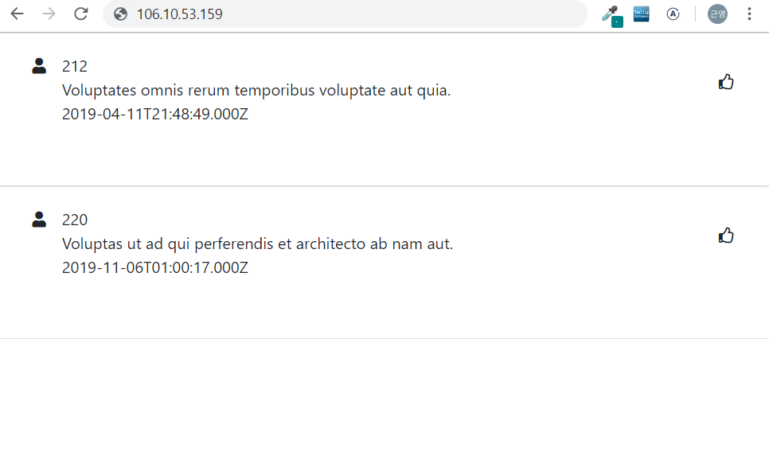
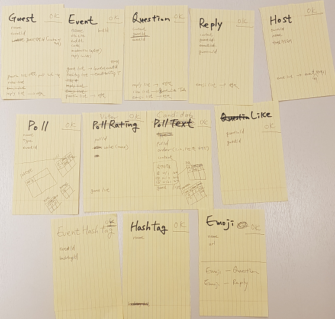
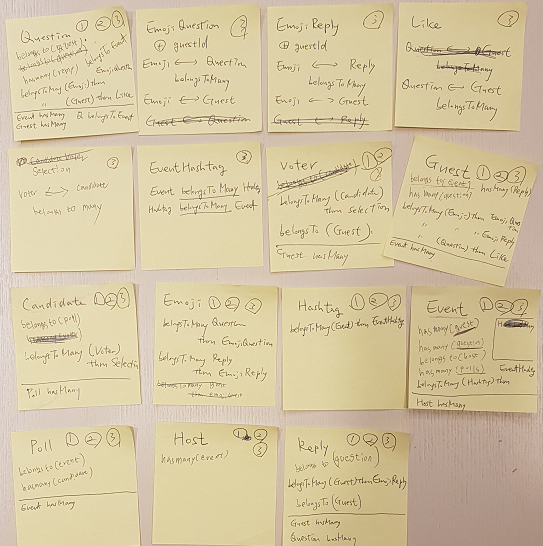

# 21 바글바글

## Sli.do clone project

---

# Database

--

# Sequelize API test

## 

--

# Entity와 Relation



--

# ERD 작성


--

# 관계 설정



--

# Sequelize migration

```
$ npx sequelize-cli init (생략)
$ npx sequelize-cli db:generate TableName
$ npx sequelize-cli migration:generate add-association-TableName (hasMany: Add Column)
$ npx sequelize-cli migration:generate associate-TableName (belongsToMany: Create Table)
$ npx sequelize-cli seed:generate
```

--

# 두 객체 사이의 서로 다른 2개의 관계

--

```
// 기존
Guest.hasMany(models.Question)
Guest.belongToMany(models.Question, {through: Like})
```

```
// 수정
Guest.hasMany(models.Question)
Guest.hasMany(models.Like)
Question.hasMany(models.Like)
```

### Like 테이블을 N:M 관계에 의한 외래키 조합이 아닌 Guest/Question과 1:N 관계의 table로 생성

--

```
// 기존
Emoji.belongsToMany(models.Question, {through: EmojiQuestion})
Emoji.belongsToMany(models.Reply, {through: EmojiReply})
```

```
// 수정
Emoji.belongsToMany(models.Question, {through: EmojiQuestion})
```

### Reply 와 EmojiReply 테이블을 삭제하고, Quesion에서 Reply 를 표현하도록 수정
